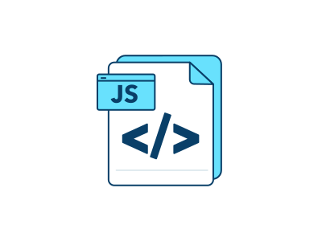

<br />
<div align="center">
  <a href="https://github.com/topcowmoo/light-employee-manager">
    
  </a>

<h3 align="center">Light Employee Manager</h3>

  <p align="center">
   Developers frequently have to create interfaces that allow non-developers to easily view and interact with information stored in databases. These interfaces are called content management systems (CMS). Light Employee Manger is a command-line application that manages a company's employee database, using Node.js, Inquirer, and MySQL.

To see how it works please view my demo here......
<br />
<a href="https://github.com/topcowmoo/light-employee-manager"><strong>Explore the docs »</strong></a>
<br />
<br />

<!-- <a href="https://pacific-basin-11264-4d339f96ea1b.herokuapp.com/">Link to Deployed app on Heroku</a> -->

·
<a href="https://github.com/topcowmoo/light-employee-manager/issues">Report Bug</a>
·
<a href="https://github.com/topcowmoo/light-employee-manager/issues">Request Feature</a>

  </p>
</div>

<!-- TABLE OF CONTENTS -->
<details>
  <summary>Table of Contents</summary>
  <ol>
    <li>
      <a href="#about-the-project">About The Project</a>
      <ul>
        <li><a href="#built-with">Built With</a></li>
      </ul>
    </li>
        <li><a href="#installation">Installation</a></li>
      </ul>
    </li>
    <li><a href="#contributing">Contributing</a></li>
    <li><a href="#contact">Contact</a></li>
    <li><a href="#acknowledgments">Acknowledgments</a></li>
  </ol>
</details>

<!-- ABOUT THE PROJECT -->

## About The Project
<a name="about-the-project"></a>
A command-line application that manages a company's employee database. It uses Node.js, Inquirer, and MySQL.

Terminal after npm start is run:


Viewing all employees:


Viewing all roles:


Viewing employees by department:


Viewing department budgets:


<p align="right">(<a href="#readme-top">back to top</a>)</p>

## Built With
<a name="built-with"></a>
<div style="display: flex; justify-content: flex-start;">
  
  
  
  
</div>

### Installation
<a name="installation"></a>
1. Clone the repo
   ```sh
   git clone https://github.com/topcowmoo/light-employee-manager
   ```
2. Install NPM packages
   ````sh
   npm install   ```
   ````
3. Start the application
   ````sh
   npm start   ```
   ````

<p align="right">(<a href="#readme-top">back to top</a>)</p>

<!-- CONTRIBUTING -->

## Contributing
<a name="contributing"></a>
Contributions are what make the open source community such an amazing place to learn, inspire, and create. Any contributions you make are **greatly appreciated**.

If you have a suggestion that would make this better, please fork the repo and create a pull request. You can also simply open an issue with the tag "enhancement".
Don't forget to give the project a star! Thanks again!

1. Fork the Project
2. Create your Feature Branch (`git checkout -b feature/AmazingFeature`)
3. Commit your Changes (`git commit -m 'Add some AmazingFeature'`)
4. Push to the Branch (`git push origin feature/AmazingFeature`)
5. Open a Pull Request

<p align="right">(<a href="#readme-top">back to top</a>)</p>

<!-- CONTACT -->

## Contact
<a name="contact"></a>
- Salvatore Mammoliti - [@github_username](https://github.com/topcowmoo) - mammoliti.sam@gmail.com

- Project Link: [https://github.com/topcowmoo/light-employee-manager](https://github.com/topcowmoo/light-employee-manager)

<p align="right">(<a href="#readme-top">back to top</a>)</p>

<!-- ACKNOWLEDGMENTS -->

## Acknowledgments
<a name="acknowledgments"></a>
- [ChatGPT](https://chat.openai.com/)
- [Best README Template](https://github.com/othneildrew/Best-README-Template)
- [Iconduck](https://iconduck.com/)
- [Shields.io](https://shields.io/)
- [MySQL](https://dev.mysql.com/)

<p align="right">(<a href="#readme-top">back to top</a>)</p>

---


